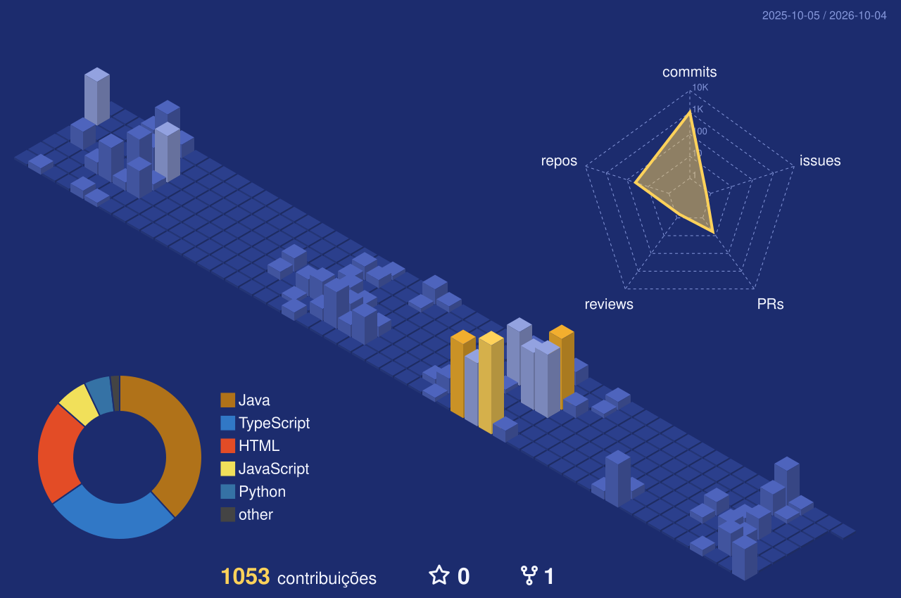

 

Comecei no RH analisando dados de contratação, passei por contas a pagar automatizando pagamento de fornecedor e virei dev de RPA na Transformação Digital. Hoje sou Business Partner no Bradesco e junto desenvolvimento, IA e BI para melhorar a rotina executiva. No caminho ficaram mais de sete robôs em produção e alguns chatbots com RAG.

Fora do banco, estudo Análise e Desenvolvimento de Sistemas na FIAP e, quando sobra tempo, escrevo firmware para ESP32.

 

### O que tenho construído

**[OrbitLink](https://github.com/Emanuel-italo/NOME-DO-REPO)**
API REST em Spring Boot para gestão da economia espacial. Projeto da FIAP.

**[Clyvo Vet](https://github.com/Emanuel-italo/NOME-DO-REPO)**
Challenge 2026 com a Clyvo: jornada de saúde do pet com IA conversacional.

**[RED.SIGNAL](https://github.com/Emanuel-italo/NOME-DO-REPO)**
Front em React para um sistema de sinais de trading cripto.

 

 

 

[LinkedIn](https://www.linkedin.com/in/SEU-LINKEDIN/) &nbsp;/&nbsp; [emanuelitaloleal@hotmail.com](mailto:emanuelitaloleal@hotmail.com)
